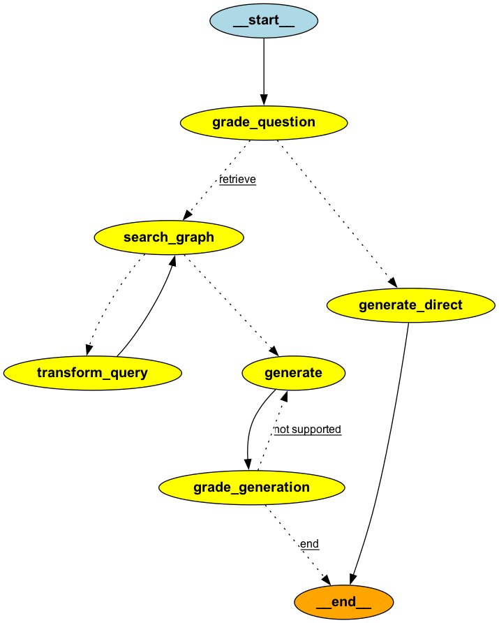

# Toy RAG Project

## 프로젝트 개요

이 프로젝트는 Retrieval-Augmented Generation (RAG) 기반의 질문 답변 시스템입니다. 사용자의 질문을 기반으로 관련 문서를 검색하고, 이를 바탕으로 정확한 답변을 생성하는 AI 어시스턴트를 구현합니다.

주요 특징:
- **하이브리드 검색**: 벡터 데이터베이스(FAISS)와 웹 검색(Tavily)을 결합한 검색 시스템
- **답변 품질 보장**: 환각(hallucination) 평가 및 재생성 메커니즘
- **대화형 인터페이스**: Streamlit을 활용한 웹 기반 채팅 인터페이스
- **모듈화된 아키텍처**: 검색 오케스트레이터, 답변 오케스트레이터 등으로 구성

## 프로젝트 구조

```
toy-advenced-rag/
├── main.py                 # Streamlit 앱 메인 파일
├── requirement.txt         # Python 의존성 패키지 목록
├── common/                 # 공통 모듈
│   ├── common_prompt.py    # 공통 프롬프트 템플릿
│   ├── llm.py             # LLM 팩토리 클래스
│   ├── ragstate.py        # RAG 상태 모델
│   └── singleton.py       # 싱글톤 패턴 구현
├── data/                   # 데이터 파일
│   ├── embeded_docs_*.jsonl  # 임베딩된 문서 데이터
│   └── faiss.index        # FAISS 벡터 인덱스
├── llm_toolkit/            # LLM 관련 툴킷
│   ├── answer_orchestrator.py    # 답변 생성 오케스트레이터
│   └── retrieval_orchestrator.py # 검색 오케스트레이터
├── services/               # 서비스 레이어
│   └── rag_pipeline.py     # RAG 파이프라인 그래프
└── vectorstore/            # 벡터 스토어 관련
    └── corpus.py           # 코퍼스 로더
```

## 아키텍처

프로젝트는 LangGraph를 활용한 상태 기반 그래프 아키텍처를 사용합니다:

1. **질문 분류**: 검색이 필요한지 직접 답변 가능한지 판단
2. **하이브리드 검색**: ANN 검색과 웹 검색을 병렬로 수행
3. **문서 필터링**: 검색된 문서의 관련성 평가 및 필터링
4. **답변 생성**: 필터링된 문서를 기반으로 답변 생성
5. **품질 평가**: 생성된 답변의 환각 여부 평가 및 재생성



## 설치 및 실행

### 1. 환경 설정

```bash
# 가상환경 생성 및 활성화
# python 3.11 준비
python -m venv .venv
source .venv/bin/activate

# 의존성 설치
pip install -r requirement.txt
```

### 2. 환경 변수 설정

`.env` 파일을 생성하고 다음 변수를 설정하세요:

```
OPENAI_API_KEY=your_openai_api_key
TAVILY_API_KEY=your_tavily_api_key

EMBEDDED_FILE_PATH=<프로젝트 경로>/data/embeded_docs.jsonl
PROJECT_PATH=<프로젝트 경로>

FAISS_INDEX_PATH=<프로젝트 경로>/data/faiss.index
DOCUMENT_PATH=<프로젝트 경로>/data/embeded_docs_48306.860223916.jsonl
```

### 3. 실행

```bash
streamlit run main.py
```

## 사용 방법

1. 브라우저에서 Streamlit 앱에 접속
2. 채팅 인터페이스에서 질문을 입력
3. 시스템이 자동으로 관련 문서를 검색하고 답변 생성
4. 참조 문서와 실행 정보를 확인 가능

### 주요 기능

- **실시간 채팅**: 대화형 Q&A 인터페이스
- **참조 문서 표시**: 답변의 근거가 되는 문서 표시
- **디버그 정보**: 각 단계의 실행 정보 확인
- **노드 로그**: 그래프 실행 로그 확인

## 핵심 컴포넌트 설명

### RetrievalOrchestrator
- 질문의 검색 필요성 판단
- 하이브리드 검색 (벡터 + 웹)
- 문서 관련성 평가 및 필터링
- 쿼리 재작성 기능

### AnswerOrchestrator
- RAG 기반 답변 생성
- 일반 답변 생성
- 환각 평가 및 품질 보장

### RAG Pipeline
- LangGraph를 활용한 워크플로우 관리
- 조건부 라우팅 및 상태 관리
